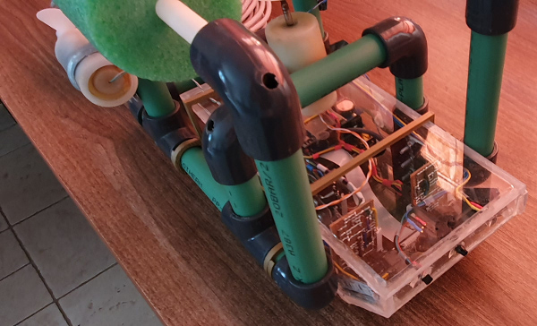

# DeepSeaRobotix - coYaght
---

This is a project for a small _Submarine Drone_. It is consisted of a simple chassis, three motors for navigation, a Raspberry Pi 3B+, an Arduino Uno with a battery operated RTC, a temperature sensor, a light sensor, a pressure sensor, a camera and some more circuitry for driving the motors from the Arduino and for power supply regulation.
There are also some parts of led strips that form the normal aviation lights (red at its left and green at its right side) and two lights for supporting the camera imaging.
The whole system can be powered through a network cable (POE). The network cable can be plugged in a laptop that then can operate the drone through a simple web page.

The idea is that the Raspberry Pi can communicate with the Arduino device through a serial port (USB connection) and also stream the image of the camera through network. It can also serve the HTML page, receive data from the Arduino device and store them in a MySQL (Mariadb) database and send commands to the Arduino for controlling the navigating motors. The Arduino can track the measurements of the time through RTC, the light, the temperature, the pressure, so it can calculate the depth, and the power voltage. At the same time it can control the motors according to commands that come from the user, through the Raspberry Pi.
Of course, for all this to happen, there must be a network connection to some device, like a laptop computer. For the whole networking part, there is a need for a DHCP that sends the appropriate settings to the laptop upon connection. So Raspberry Pi runs a DHCP server on a subnet that is not commonly used in SOHO networks. This is mandatory because a laptop can be connected to a network through its Wireless device while at the same time be connected to the coYaght through its Ethernet device. The two network subnets must be different to avoid conflicts or other faulty communication. The subnet chosen is the 192.168.111.1/24 and the coYaght's IP is selected to be 192.168.111.10

In this project there are three major parts:

* The HTTP server, written in Python 3
* The web page, written in HTML/CSS/JavaScript. More information for the web User Interface are in the [web](web) subdirectory.
* The Arduino sketch for taking measurements and communicate data to and from the serial port. More information about the code that runs on the Arduino can be found in the [HydroSensors](HydroSensors) subdirectory.

## Web Server (Python 3 code)

For the web server, the team chose to use python 3 and not another ready made web server as apache etc. The reason is that python can handle the Pi Camera easily and there are lots of examples in the internet. The one we used as a starting point is http://picamera.readthedocs.io/en/latest/recipes2.html#web-streaming. Python 3 contains modules for handling a serial port, communicating with a MySQL database, running a simple HTTP server, handling the time and all the other necessary jigsaw puzzle pieces we could use to reach our goal.
There are three files for the web server:

* **database.py**: This is the file that creates a class for handling the MySQL database used for coYaght
* **serial\_arduino.py**: This is the file that creates classes to be used for serial communication with the Arduino circuitry
* **controller.py**: This is the main file that uses the other two. It is the complete web server and controller of the system

Of course, each file contains the necessary documentation. All python files lie in the root directory of this project.
Lets see what each file contains:

### database.py

The database the coYaght device uses contains only one table that holds the measurements. The database name is __*coYaght*__. The needed table is only one, named _measurements_. In this table there are columns for:

* _DateStamp_: contains the Date/Time of the measurement
* _Temp_: contains the measured Temperature in Celsius
* _Press_: contains the measured Pressure in KPa
* _Depth_: contains normalized depth according to pressure measurement
* _Lux_: contains the value of the light sensor, means ambient light in Lux
* _Batt_: contains the value of the battery voltage

Only one class is defined in this file, the **ArduinoDB** class. Through this class the system can handle the database of the coYaght. A preview of the methods follows:

* _connect()_: Is the first method that should be called after creating an instance of this class. It is used to connect to the database server in order to exchange data with it
* _disconnect()_: After a call to this method the connection to the database is terminated thus freeing the resources used for it.
* _isconnected()_: Checks if there is connection to the database and data can be stored to or read from it.
* _insert(indata)_: Inserts data into the _measurements_ table. The _indata_ parameter is a list of the values to be inserted. Also keeps a copy of the last data inserted in the database table and notifies each other thread for the existence of newly stored data. More specifically:
	1. The date/time as a string in the format _"YYYY-MM-DD HH:mm:ss"_, where _YYYY_ is the full year, _MM_ is the number of the month in two digits notation (01 to 12), _DD_ is the number of the day of the month in two digits notation (01 to 31, depending also of the month), _HH_ is the hour in two digits notation (00 to 24), _mm_ is the minute in two digits notation (00 to 59) and _ss_ is the second in two digits notation (00 to 59)
	2. The temperature reading in Celsius
	3. The pressure reading in KPa.
	4. The calculated depth in m.
	5. The ambient light reading in Lux
	6. The battery voltage in Volts

* _fetchLastData()_: returns the last stored data as a list
* _fetchset(StartDate, EndDate, Limit (optional), Offst (optional))_: returns a number of rows stored in the database. The query has a _starting date/time_, an _ending date/time_ that describes the rows to be returned and optionally can contain a _Limit_ value that limits the number of returned batch of rows and an _Offst_ that places an offset of the starting point of the first row.
* _fetchlast(Limit)_: Returns the last rows inserted in the database. The number of rows to be returned is set by the _Limit_ parameter.

### serial\_arduino.py

Since there is the need of asynchronously sending and receiving data through the serial port, this file defines three classes for this process. The system should use threads in order to achieve the asynchronous communication from the Arduino. So, derived classes from LineReader and ReaderThread should be defined.

#### SerTrans Class

This class is derived from LineReader class. Its purpose is to perform the transactions between the server and the serial port. The data received are lines of text, so it is used for ASCII encoding with the usual line terminating characters, CR and LF. The class takes a queue object to store the incoming data. The queue will be used as a FIFO. Each line that comes from the serial port is stored in the queue. The consumer process (see later in SerProto class) will take the data from he queue and consume them. If there is no queue specified the incoming data are discarded.

Lets take a look at its methods:

* _setqueue(qpass)_: Using this method the intermediate queue object can be set.
* _handle_line(inline)_: When there is a new line from the serial port, this method is called. Here the incoming data are stored in the defined queue.
* _write_line(text)_: Sends a line of data to the serial port.

#### SerThread Class

This class is derived from ReaderThread. The only reason to alter this class is to add the usage of a queue, when an object of SerTrans is created. The necessary code is added in the run() method of this class. There is no other alteration or addition to the ReaderThread class.

#### SerProto class

This is the main class used for the whole protocol of data exchange between the server and the Arduino. This class uses a database object and a serial port and binds them together. The incoming data are filtered and stored in the database while the outgoing data are filtered and become commands to the Arduino hardware.

A closer look to its methods follows:

* _connect()_: Sets the parameters of the serial port to be used. Then it calls _open()_ method to establish a connection with it.
* _open()_: Opens a connection to the serial port defined during initialization of the instance and starts the necessary threads for the asynchronous operations; one SerThread and one for getting data from the intermediate queue and consume them
* _close()_: Terminates the running threads the _open()_ method started. Upon exiting the SerThread, the system also closes the connection to the serial port.
* _disconnect()_: Releases the resources used for connection
* _start_data()_: Sends the \"S1\" command to the Arduino. This makes it to start taking measurements from the sensors and return them back to the system. Every second there is a new data line.
* _stop_data()_: sends the \"S0\" command to the Arduino. This makes the Arduino stop taking measurements.
* _getRTC()_: The Arduino hardware is connected to a RTC shield that counts the time even when the system is powered off. Using this method the system returns the Date and Time stored in this RTC, in the form of a _time\_struct_.
* _setRTC(indate)_: Sends the appropriate command (command \"T\") to the Arduino hardware to alter the Date and Time stored in the RTC. The _indate_ parameter is a time\_struct structure containing the new Date/Time values
* _movecmd(cmdin)_: Sends a _move_ command to the Arduino. A _move_ command is one that activates or deactivates one or more motors of coYaght. The _cmdin_ parameter defines the command to be send. All the available commands are stored in _mComms[]_ list and _cmdin_ parameter is the index of the needed command in this list.
* _waitInit()_: It waits until the initialization of the Arduino finishes. Upon connection, the Arduino starts an initialization process to calibrate the sensors. During this time no command is accepted. Using _waitInit()_ method ensures that this initialization process is finished and the Arduino is ready to accept commands.
* _write_line(text)_: This just calls the _write()_ method of the SerThread instance. It is used to send a text line of data to the serial port.
* _incoming()_: This is the part that becomes the queue handling thread. It takes the line stored in queue upon reception and filters it acting as needed. It can track the initialization process of the Arduino, get the date when asked or takes a line of measurement and stores it in the database.

### controller.py

The main file of the project is this one. It contains the server which uses the other modules described earlier, to perform all the needed actions. Its purpose is to serve the necessary files of the web page that forms the user interface. This file is used as a systemd service, so it starts on boot of the operating system. It defines three classes:

* __StreamingOutput__ Class: Is the buffer the camera stores its frames.
* __StreamingHandler__ Class: This class derives from _BaseHTTPRequestHandler_. Every time there is a request from the network client, an instance of this class is created to serve that request only.
* __SteamingServer__ Class: This class derives from _HTTPServer_ and _ThreadingMixIn_ classes. This is the serving class that listens to the port 80 and dispatches each request to a _StreamingHandler_ instance.

#### StreamingOutput class

This class contains a buffer that holds the frames of the camera, a frame that contains only the last frame and a condition object to synchronize the threads that want to receive the frames of the camera. The only method in this class is _write(buff)_. This method writes a new frame into the buffer, sets the frame variable and notifies all the processes to receive this last frame.

#### StreamingHandler class

This class is for creating instances to serve each incoming request from network clients. It serves both **GET** and **POST** requests. The **GET** requests are for the files of the web page, including the streaming one. It contains an Access Control List to filter the requests and avoid the ones that are not allowed. The _doGET()_ method serves the **GET** type requests.
The _doPOST()_ method serves the **POST** type requests. It also contains an Access Control List to filter out all unwanted requests. All the requests that are used for functionality purposes are of **POST** type and usually the return to the client is either an empty one, a JSON object, or a simple text describing the status of the command issued.

#### StreamingServer class

The only thing added in this class is the status of the video and the serial port used to communicate data to and from the Arduino module. Using that port it can receive data and also send commands.

### Main program

In the main program a database object is created to store to and retrieve data from the coYaght database. Then the camera module is activated ans starts to receive a stream of frames in _mjpeg_ format. Then a server is started, listening to port 80 to handle HTTP requests.
The web files lie under the _web_ subdirectory. The served User Interface appears in the following image.
One important note is that due to the fact the script should run on boot as a systemd service, there was a problem with the python path. During the developing process this code could run under a user (pi) fine without problems. But when ran under root the python path is different. This can easily be fixed by setting the PYTHONPATH environment variable. But when ran as a service the python path is also different. So, in the code there is a part that finds if a part of the path is missing and if yes it is appended, so the python code can find all the necessary modules to import.

## Conclusion

This project took place at the European Junior Achievement 2019-2020 competition. It is a school project of the 1st Junior High School of Gerakas. It received a 91/100 grade and won the New Technologies Utilization Special Award. The students team was:

* Helen Zografou
* Antonis Lekkas
* Antigoni Bouki
* Eleftheria Kalavrou
* Stratos Amerikanos
* John Drosakis
* Panagiotis Adamantiades

The supervising teachers were:

* Theodoros Kourtesis
* Elias Chrysocheris
